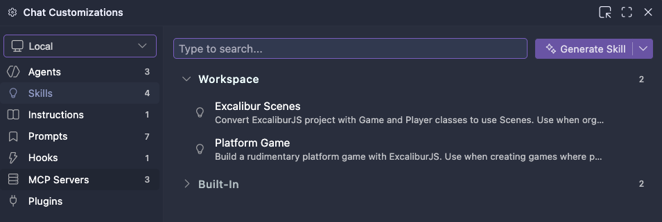

# Excalibur Startproject 2026

- Ga naar [https://github.com/HR-CMGT/prg4-startproject-2026](https://github.com/HR-CMGT/prg4-startproject-2026)
- Klik op ***USE THIS TEMPLATE > CREATE A NEW REPOSITORY***. Dit kopieert het project naar jouw eigen github.
- Vanaf je *eigen github* kopieer je de `git url` (onder de "code" button).
- Open VS Code. Klik op "file" > "clone repository" > plak hier je url.
- Typ `npm install` en `npm run dev` in de terminal in VS Code. Dit start de development omgeving van Vite.
- In `game.js` kies je de resolutie van de game.
- Installeer de [Chrome Excalibur Debugger](https://chromewebstore.google.com/detail/excalibur-dev-tools/dinddaeielhddflijbbcmpefamfffekc)
- [Bekijk het instructie filmpje!](https://youtu.be/UIVpe4L5_P4)
- Vervang deze readme file met een beschrijving van jouw game.

   

### Resoluties

| Widescreen 16/9 | Retro 4/3 |
|---|---|
| 640 × 360 | 512 × 384 |
| 800 × 450 | 640 × 480 |
| 1280 × 720 | 800 × 600 |

   

### AI Instructies

Als je copilot binnen dit project gebruikt zullen de [Excalibur instructions](./.github/copilot-instructions.md) automatisch meegenomen worden. Dit kan je zien door in het AI venster op settings te klikken. Je kan de beschikbare *skills* gebruiken door een `/` te typen. (*bv. voor het bouwen van een platform game of het toevoegen van scenes*).

⚠️ *AI kan fouten maken! Vergelijk de code altijd met de Excalibur documentatie en lesstof*

